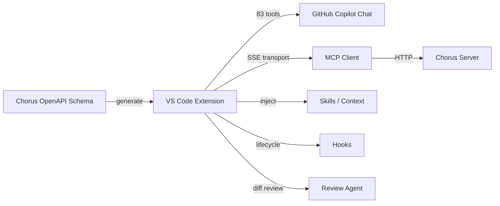

# Chorus for GitHub Copilot

[](LICENSE)
[](https://code.visualstudio.com/)

> Integrate **Chorus AI project management** with GitHub Copilot — 83 tools, skills injection, hooks, and automated code review.

## ✨ Features

- **83 Language-Model Tools** — generated from the Chorus OpenAPI schema covering projects, tasks, ideas, proposals, documents, comments, activity, admin, and presence
- **Chat Participant `@chorus`** — slash commands `/checkin`, `/tasks`, `/session`, `/help`
- **Skills Injection** — load custom Markdown skills (with YAML frontmatter) into Copilot context
- **Hook Lifecycle** — run shell scripts on pre/post events (e.g., lint before submit)
- **Automated Code Review** — diff-aware review agent with configurable criteria
- **MCP Transport** — SSE-based connection to any Chorus server instance
- **Telemetry Guard** — opt-in only, disabled by default

## 🚀 Quick Start

1. Install the extension from the VS Code Marketplace (or `code --install-extension turbo998.chorus-copilot`)
2. Open **Settings** → search `chorus`
3. Set `chorus.serverUrl` to your Chorus instance URL
4. Set `chorus.apiKey` to your API key
5. Open Copilot Chat and type `@chorus /tasks`

## ⚙️ Configuration

| Setting | Type | Default | Description |
|---|---|---|---|
| `chorus.serverUrl` | `string` | `""` | Chorus server URL |
| `chorus.apiKey` | `string` | `""` | API key for authentication |
| `chorus.autoSession` | `boolean` | `true` | Auto-start MCP session on activation |
| `chorus.enabledModules` | `array` | `["pm","developer","session","public","admin","presence"]` | Tool modules to enable |
| `chorus.requestTimeout` | `number` | `30000` | Request timeout in ms |
| `chorus.telemetry.enabled` | `boolean` | `false` | Enable anonymous telemetry |
| `chorus.heartbeatInterval` | `number` | `60000` | Session heartbeat interval in ms |

## 🏗️ Architecture



## 📁 Project Structure

```
src/
├── extension.ts          # Entry point
├── chorus-mcp-client.ts  # MCP client wrapper
├── telemetry.ts          # Telemetry guard
├── schema/               # 83 tools from OpenAPI
├── mcp/                  # MCP transport & session
├── context/              # Context builder & providers
├── skills/               # Skills loader & parser
├── hooks/                # Hook lifecycle runner
└── reviewer/             # Code review agent
```

## 🤝 Contributing

1. Fork the repository
2. Create a feature branch (`git checkout -b feat/amazing-feature`)
3. Run tests: `npm test`
4. Commit changes and open a Pull Request

See [docs/getting-started.md](docs/getting-started.md) for development setup.

## 📄 License

[MIT](LICENSE) © 2025 Chen Qi
