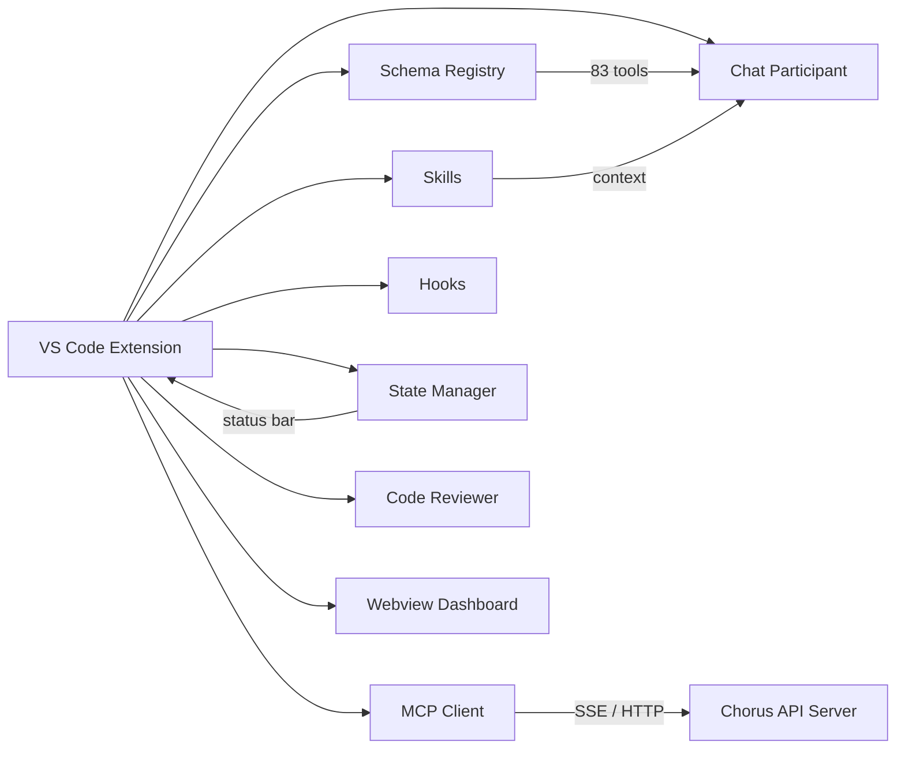

# Chorus for GitHub Copilot

[](LICENSE)
[](https://code.visualstudio.com/)
[](CHANGELOG.md)

**Chorus for GitHub Copilot** bridges your Chorus AI project-management platform with GitHub Copilot Chat, exposing 83 language-model tools, a `@chorus` chat participant, custom skills injection, lifecycle hooks, automated code review, a task dashboard webview, and real-time state management — all from within VS Code.

---

## ✨ Features

| # | Module | Description |
|---|--------|-------------|
| 1 | **Schema Registry** | 83 tools auto-generated from the Chorus OpenAPI spec (projects, tasks, ideas, proposals, documents, comments, activity, admin, presence) |
| 2 | **MCP Client** | SSE-based Model Context Protocol transport with session heartbeat and reconnection |
| 3 | **Skills Injection** | Load custom Markdown skills (YAML frontmatter) into Copilot context at runtime |
| 4 | **Hook Lifecycle** | Run shell scripts on pre/post events (e.g., lint before submit, notify after checkin) |
| 5 | **State Management** | Reactive connection, task, and session state with status-bar integration |
| 6 | **Chat Participant** | `@chorus` participant with `/checkin`, `/tasks`, `/session`, `/help` slash commands |
| 7 | **Code Reviewer** | Diff-aware review agent with configurable criteria and inline annotations |
| 8 | **Webview Dashboard** | Activity-bar task dashboard with real-time project overview |
| 9 | **Context Builder** | Composable context providers (session, task, skills) for rich Copilot prompts |
| 10 | **Telemetry Guard** | Opt-in only telemetry, disabled by default |

---

## 🚀 Quick Start

1. **Install** — from the VS Code Marketplace or run:
   ```
   code --install-extension turbo998.chorus-copilot
   ```
2. **Configure** — open **Settings → chorus** and set `chorus.serverUrl` + `chorus.apiKey`
3. **Use** — open Copilot Chat and type `@chorus /tasks`

---

## ⚙️ Configuration

| Setting | Type | Default | Description |
|---------|------|---------|-------------|
| `chorus.serverUrl` | `string` | `""` | Chorus server URL |
| `chorus.apiKey` | `string` | `""` | API key for authentication |
| `chorus.autoSession` | `boolean` | `true` | Auto-start MCP session on activation |
| `chorus.enabledModules` | `array` | `["pm","developer","session","public","admin","presence"]` | Tool modules to enable |
| `chorus.requestTimeout` | `number` | `30000` | Request timeout (ms) |
| `chorus.telemetry.enabled` | `boolean` | `false` | Enable anonymous telemetry |
| `chorus.heartbeatInterval` | `number` | `60000` | Session heartbeat interval (ms) |

---

## 🏗️ Architecture



---

## 📁 Project Structure

```
src/
├── extension.ts          # Entry point & activation
├── chorus-mcp-client.ts  # MCP client wrapper
├── telemetry.ts          # Telemetry guard
├── schema/               # 83 tools from OpenAPI (pm, developer, session, admin, presence)
├── mcp/                  # Transport, session, errors
├── context/              # Context builder & providers (session, task, skills)
├── skills/               # Skills loader, parser, index, service
├── hooks/                # Hook lifecycle runner & resolver
├── reviewer/             # Code review agent, criteria, git-diff
├── state/                # State manager, connection/task state, status bar
├── chat/                 # Chat participant, formatter, memory, quick-actions, progress
└── webview/              # Task dashboard webview
```

---

## 🛠️ Skills Authoring

Create `.md` files in `.chorus/skills/` with YAML frontmatter:

```markdown
---
name: my-skill
trigger: onTask
description: Summarise task context
---
Given the current task {{task.title}}, provide a summary…
```

Skills are automatically loaded and injected into Copilot context. See [docs/skills-authoring.md](docs/skills-authoring.md).

---

## 🪝 Hooks

Define shell hooks in `.chorus/hooks/`:

```
.chorus/hooks/
├── pre-checkin.sh
├── post-checkin.sh
└── pre-submit.sh
```

Hooks run automatically at lifecycle events. See [docs/hooks-guide.md](docs/hooks-guide.md).

---

## 🤝 Contributing

1. Fork the repository
2. Create a feature branch (`git checkout -b feat/amazing-feature`)
3. Run tests: `npm test`
4. Commit changes and open a Pull Request

See [docs/getting-started.md](docs/getting-started.md) for development setup.

---

## 📄 License

[MIT](LICENSE) © 2025 Chen Qi
