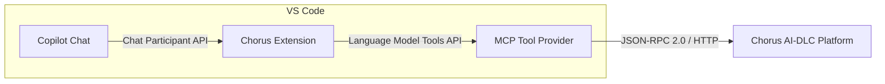

# Chorus-GitHub-Copilot

[](https://code.visualstudio.com/)
[](https://www.typescriptlang.org/)
[](https://modelcontextprotocol.io/)
[](LICENSE)
[](https://github.com/features/copilot)

> Bridge Chorus AI-DLC platform to GitHub Copilot Chat via MCP protocol.
>
> 通过 MCP 协议将 Chorus AI-DLC 平台桥接至 GitHub Copilot Chat。

---

## Architecture | 架构



## Features | 功能特性

- 🔗 **MCP Protocol Integration** — Seamless bridge between Copilot Chat and Chorus platform
- 🛠️ **6 Core Tools (POC)** — Check-in, task discovery, claiming, reporting, and verification
- 🎯 **41 Tools (Full)** — Complete coverage: 28 public + 8 session + 5 developer tools
- 💬 **Natural Language** — Interact with Chorus via conversational AI in Copilot Chat
- 🔐 **Secure Config** — API key and endpoint managed via VS Code settings
- ⚡ **JSON-RPC 2.0** — Efficient communication over HTTP

---

## Quick Start | 快速开始

### 1. Install | 安装

```bash
git clone https://github.com/turbo998/Chorus-GitHub-Copilot.git
cd Chorus-GitHub-Copilot
npm install
```

### 2. Configure | 配置

Add to your VS Code `settings.json`:

```json
{
  "chorus.url": "https://your-chorus-instance.com",
  "chorus.apiKey": "your-api-key"
}
```

### 3. Use | 使用

1. Press `F5` to launch the Extension Development Host
2. Open Copilot Chat (`Ctrl+Shift+I`)
3. Type `@chorus` followed by your request:

```
@chorus check me in
@chorus what tasks are available?
@chorus claim task #123
```

---

## Tool Categories | 工具分类

| Category 分类 | Count 数量 | Examples 示例 | Status 状态 |
|---|---|---|---|
| **Public 公共** | 28 | `checkin`, `get_available_tasks`, `list_tasks` | 🟡 Planned |
| **Session 会话** | 8 | `claim_task`, `report_work`, `submit_for_verify` | 🟡 Planned |
| **Developer 开发者** | 5 | Debug tools, diagnostics | 🟡 Planned |
| **POC Core 核心** | 6 | `checkin`, `get_available_tasks`, `list_tasks`, `claim_task`, `report_work`, `submit_for_verify` | ✅ Done |

---

## Roadmap | 开发路线

- [x] POC — 6 core tools with MCP integration
- [ ] Full public tool coverage (28 tools)
- [ ] Session management tools (8 tools)
- [ ] Developer tools (5 tools)
- [ ] VSIX marketplace publishing
- [ ] Multi-language task descriptions
- [ ] Offline caching & retry logic

---

## Contributing | 贡献指南

1. Fork the repository
2. Create a feature branch: `git checkout -b feat/your-feature`
3. Commit changes: `git commit -m "feat: add new tool"`
4. Push and open a Pull Request

Please follow [Conventional Commits](https://www.conventionalcommits.org/) for commit messages.

欢迎贡献！请 Fork 本仓库，创建特性分支，提交 PR。提交信息请遵循约定式提交规范。

---

## License | 许可证

[MIT](LICENSE)
